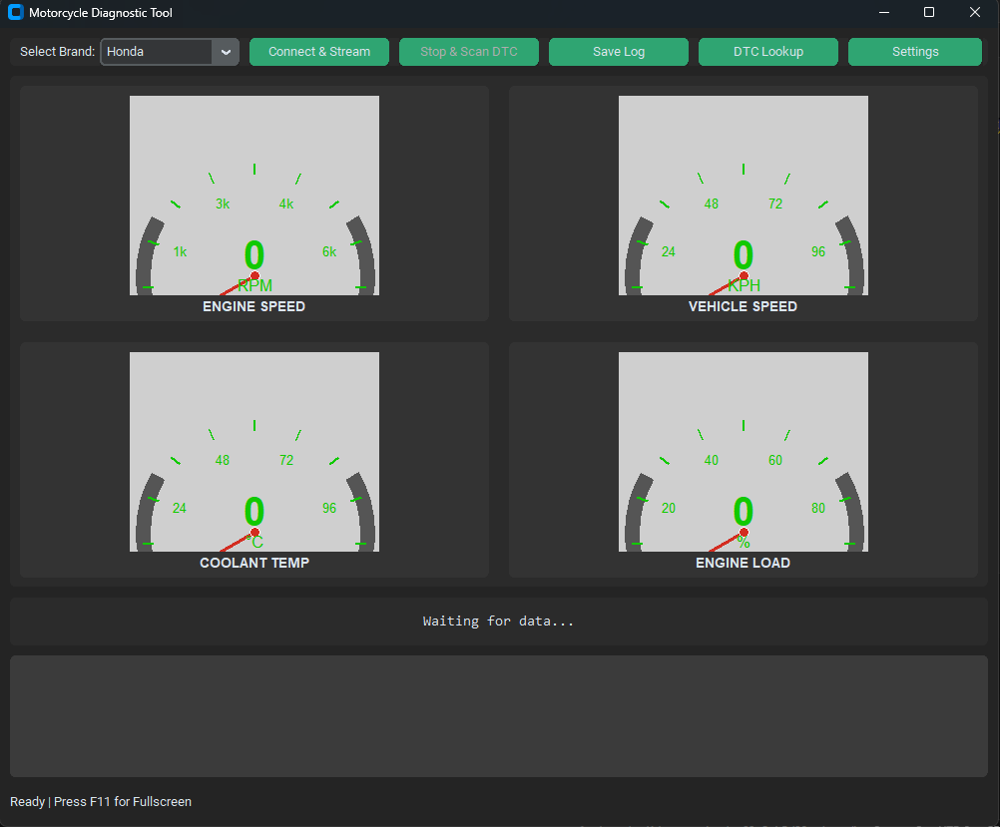

# Motorcycle Diagnostic Tool 🏍️🔧

A professional-grade, cross-platform desktop application for real-time motorcycle diagnostics. Built with Python and CustomTkinter, this tool provides a modern dashboard interface for monitoring live engine data and retrieving fault codes using a standard ELM327 adapter.

The project is architecturally sound, featuring a separation of concerns between the UI, diagnostic logic, and a full-featured simulator for hardware-free development.



---

### ## Key Features

#### Live Dashboard & Monitoring
* **Modern Graphical User Interface:** A sleek and intuitive UI built with CustomTkinter, featuring a dark theme and customizable accent colors.
* **Real-Time Graphical Gauges:** Displays live data on four primary gauges:
    * Engine Speed (RPM)
    * Vehicle Speed (KPH)
    * Coolant Temperature (°C)
    * Engine Load (%)
* **Secondary Data Panel:** Shows additional live sensor data, including Intake Air Temperature, Intake Manifold Pressure, and Battery Voltage.
* **Fullscreen Mode:** Press **F11** for an immersive, fullscreen dashboard view.

#### Comprehensive Diagnostics
* **Live Data Streaming:** Continuously polls the ECU for smooth, real-time gauge animation and data updates.
* **Fault Code Scanning:** Retrieves and displays stored Diagnostic Trouble Codes (DTCs) with detailed descriptions from a comprehensive local database.
* **Freeze Frame Data:** Automatically captures and displays a snapshot of sensor data from the exact moment a fault code was triggered, providing critical diagnostic context.

#### User-Friendly Utilities
* **DTC Lookup Tool:** A separate pop-up window to manually look up any fault code from the local database.
* **Settings Menu:** A dedicated settings window to easily configure the connection method (Simulator, Wi-Fi, Bluetooth) and the specific adapter address (`IP:Port` or `COM` Port).
* **Data Logging:**
    * **Session Log:** A "Save Log" button to export the current diagnostic session's text output to a timestamped `.txt` file.
    * **Freeze Frame Log:** Automatically saves a permanent record of all captured Freeze Frame data to `freeze_frame_log.json` for later review.

#### Advanced Architecture
* **Modular Codebase:** The project is refactored into multiple files for maintainability and scalability (`main.py`, `gui_app.py`, `diagnostics.py`, `simulator.py`, etc.).
* **Responsive UI:** Uses threading to run all diagnostic communication in the background, ensuring the user interface never freezes.
* **Full Simulator Mode:** A complete simulator is built-in for hardware-free development, testing, and demonstration. It uses the full DTC database to provide realistic, randomized data.
* **Persistent Configuration:** User settings are saved to a `settings.ini` file and loaded automatically on startup.

---

### ## Project Structure
The application is organized into logical modules for maintainability:
-   **`main.py`**: The main entry point for the application.
-   **`gui_app.py`**: Contains the main `App` class and all CustomTkinter UI code.
-   **`diagnostics.py`**: Handles all communication with the OBD-II adapter.
-   **`simulator.py`**: Contains the `OBDSimulator` class for hardware-free testing.
-   **`custom_widgets.py`**: Defines the reusable `Gauge` widget.
-   **`config_manager.py`**: Manages loading and saving user settings to `settings.ini`.
-   **`dtc_database.py`**: A comprehensive Python module containing thousands of DTCs and their descriptions.

---

### ## How to Use

1.  **Clone the repository** and set up a Python virtual environment.
2.  **Install dependencies:**
    ```powershell
    pip install customtkinter obd
    ```
3.  **Run the application** for the first time to generate the default `settings.ini` file:
    ```powershell
    py main.py
    ```
4.  **Configure:** Click the **"Settings"** button to choose your connection mode (e.g., "Simulator" or "Wi-Fi") and enter your adapter's address.
5.  **Connect:** Click **"Connect & Stream"** to begin monitoring your vehicle.